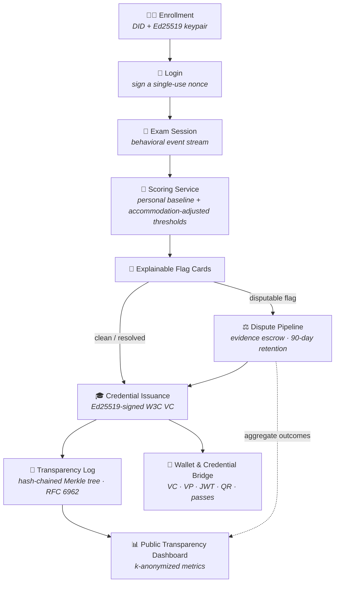

<div align="center">

# 🛡️ PROVORA

### *Verifiable exam integrity — without the black box.*

Every integrity decision is **explainable**, **disputable**, and **publicly auditable**.
The credential a student earns is **theirs to take anywhere**.


[The Problem](#-the-problem-we-are-solving) • [What Makes Us Different](#-what-makes-examidentity-unique) • [Features](#-top-3-features) • [Pipeline](#-how-the-system-works) • [Architecture](#-architecture) • [Quickstart](#-getting-started)

</div>

---

## 🔥 The Problem We Are Solving

Online proctoring today fails students and institutions alike:

| 🚫 The status quo | 💥 Why it hurts |
|---|---|
| **Black-box flagging** | "Suspicious activity detected" — no evidence, no measurement, no way to contest it |
| **One-size-fits-all thresholds** | Students with accommodations (screen readers, motor/attention conditions) get flagged at far higher rates |
| **Zero accountability** | Nobody can see how often a proctoring system is wrong, or whether evidence is ever deleted |
| **Locked-in credentials** | Exam results die inside a vendor portal — unverifiable, unshareable, unportable |

> **ExamIdentity flips the model:** the *system* must prove its fairness to the student — not the other way around.

## ✨ What Makes ExamIdentity Unique

- 🔍 **Explainable flags, not verdicts** — every flag carries the observed value, the student's *personal* baseline, the threshold, confidence, and dispute rights. The builder is deterministic and rule-based, never a black box.
- ♿ **Accommodation-aware scoring** — thresholds adapt per accommodation (a screen-reader accommodation relaxes the gaze threshold 3×). Accessibility is never punished as cheating.
- 🔗 **Cryptographic transparency log** — an append-only, hash-chained Merkle log (RFC 6962) makes tampering detectable *by anyone*.
- 🎓 **Self-owned credentials** — students hold a DID and receive Ed25519-signed W3C Verifiable Credentials they can export and verify anywhere.
- 🔒 **Privacy by design** — k-anonymized public metrics, 90-day auto-deletion of evidence, and no personal data on any public surface.

---

## 🏆 Top 3 Features

<details open>
<summary><b>1️⃣ 📇 Explainable Flag Cards</b> — <i>proctoring flags a student can actually understand and contest</i></summary>
<br>

Replaces vague "suspicious activity detected" with an evidence-backed card showing:

- **What** was observed — with the measured value
- **How** it compares to the student's *personal baseline* and the policy threshold
- **Whether** an accommodation adjusted that threshold
- **How confident** the model is
- **What happens next** — including the right to dispute

Deterministic and rule-based: the same inputs always produce the same explanation.
📖 [docs/explainable-flag-cards.md](docs/explainable-flag-cards.md)

</details>

<details open>
<summary><b>2️⃣ 🌉 Cross-Platform Credential Bridge</b> — <i>credentials that outlive the platform</i></summary>
<br>

Export an integrity credential as:

| Format | Status |
|---|---|
| W3C Verifiable Credential (JSON) | ✅ |
| Ed25519-signed Verifiable Presentation | ✅ |
| Compact signed JWT | ✅ |
| Short-lived QR verification link | ✅ |
| LinkedIn "Add to Profile" | ✅ |
| Apple / Google Wallet · OID4VCI | 🟡 demo stubs |

Verifiers confirm authenticity **without ever contacting the platform**.
📖 [docs/cross-platform-credential-bridge.md](docs/cross-platform-credential-bridge.md)

</details>

<details open>
<summary><b>3️⃣ 📊 Public Transparency Dashboard</b> — <i>the platform holds itself accountable</i></summary>
<br>

Fully anonymized, public accountability metrics:

- Flag rates by category — *including false-positive rates*
- Dispute outcomes & average resolution time
- Model drift (PSI) per feature
- Evidence-deletion compliance vs. the 90-day window
- Transparency-log health with the published Merkle root

Counts below the k-anonymity threshold of **5** are suppressed — no individual is ever identifiable.
📖 [docs/public-transparency-dashboard.md](docs/public-transparency-dashboard.md)

</details>

---

## ⚙️ How the System Works



<details>
<summary><b>🔎 Step-by-step walkthrough</b></summary>

### 1️⃣ Enrollment & Identity
A student enrolls and receives a **DID** backed by an Ed25519 keypair (`services/api/src/services/identity`). The public key is registered with the platform; the private key proves identity from then on.

### 2️⃣ Login (Challenge / Response)
No passwords. The server issues a single-use, 5-minute nonce; the student signs it, the server verifies the signature against the stored public key, then mints a JWT (`services/api/src/auth/authService.ts`).

### 3️⃣ Exam Session & Behavioral Events
Behavioral events (gaze, typing cadence, audio, device integrity) are captured as a session event stream (`services/api/src/services/session`). The Go realtime service (`services/realtime`) fans events out over WebSockets via Redis pub/sub.

### 4️⃣ Scoring & Explanation Building
The Python scoring service (`services/scoring`) evaluates each signal against the student's **personal baseline** and the **accommodation-adjusted threshold**. Severity derives from `observed / adjustedThreshold`; within-threshold observations auto-resolve. The API keeps a local fallback builder so explanations are always available.

### 5️⃣ Explainable Flag Cards
Each flag renders as a card with the observed value, baseline, threshold, accommodation note, confidence, and recommended action (`apps/web/src/components/exam`).

### 6️⃣ Dispute Pipeline & Evidence Escrow
Disputable flags can be contested (`services/api/src/services/dispute`). Evidence is held in escrow (`services/api/src/services/escrow`) and auto-deleted after its 90-day retention window — deletion compliance is itself a published metric.

### 7️⃣ Credential Issuance
When a session completes cleanly (or disputes resolve), the platform issues a **W3C Verifiable Credential** with an integrity score band, signed with the platform's Ed25519 key (`services/api/src/services/credential`).

### 8️⃣ Transparency Log
Issuance and key lifecycle events are appended to a hash-chained log whose Merkle root (RFC 6962 leaf/node domain separation, `packages/crypto-utils/src/merkle.ts`) is published and independently verifiable.

### 9️⃣ Wallet & Credential Bridge
Students export or share their credential from the wallet (`apps/web/src/app/wallet`) in any supported format — see [Feature 2](#-top-3-features).

### 🔟 Public Transparency Dashboard
Aggregate accountability metrics are published at `/transparency` with k-anonymity suppression — see [Feature 3](#-top-3-features).

</details>

---

## 🏗️ Architecture

| Component | Stack | Role |
|---|---|---|
| 🖥️ `apps/web` | Next.js (App Router) | Student/web UI: enroll, exam, wallet, transparency |
| 🔌 `services/api` | Fastify · TypeScript | Core API: auth, sessions, disputes, credentials, transparency |
| 🧠 `services/scoring` | FastAPI · Python | Behavioral scoring + deterministic explanation builder |
| ⚡ `services/realtime` | Go · WebSockets · Redis | Live session event fan-out |
| 🔐 `packages/crypto-utils` | TypeScript | Ed25519 signing, encryption, Merkle tree |
| 🧩 `packages/shared-types` | TypeScript | Shared data contracts across services |
| 🐳 `infrastructure` | Docker · SQL | Postgres init, migrations, seed, docker-compose |

## 🚀 Getting Started

```bash
# 1. Install dependencies (pnpm workspace)
pnpm install

# 2. Start Postgres + Redis
docker compose -f infrastructure/docker/docker-compose.yml up -d

# 3. Initialize the database
psql "$DATABASE_URL" -f infrastructure/db/init.sql
psql "$DATABASE_URL" -f infrastructure/db/migrations/010_identity.sql
psql "$DATABASE_URL" -f infrastructure/db/seed.sql   # optional demo data

# 4. Configure environment
cp .env.example .env                       # fill in real values
cp services/api/.env.example services/api/.env

# 5. Run the API and web app
pnpm --filter @examidentity/api dev
pnpm --filter web dev                      # → http://localhost:3000
```

> 💡 The scoring and realtime services are **optional** for the MVP — the API falls back to a local explanation builder when scoring is unreachable.

📦 Production deployment: [`docs/DEPLOY.md`](docs/DEPLOY.md) · Feature deep-dives: [`docs/`](docs/)

## 📄 License

See [LICENSE](LICENSE).

---

<div align="center">
<sub>Built with ❤️ for fair, transparent, and portable exam integrity.</sub>
</div>
